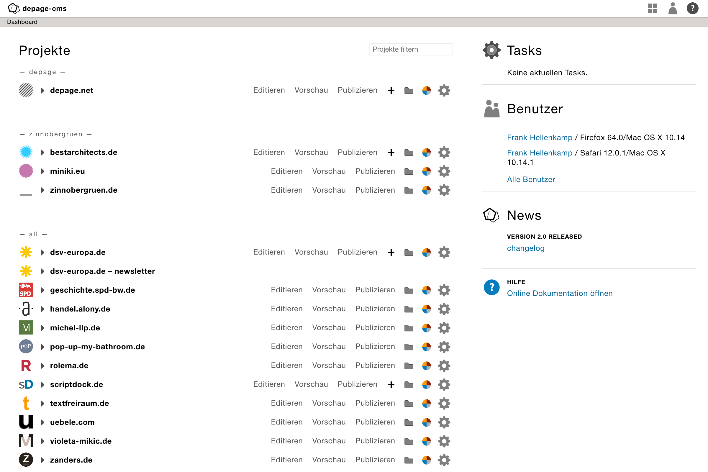
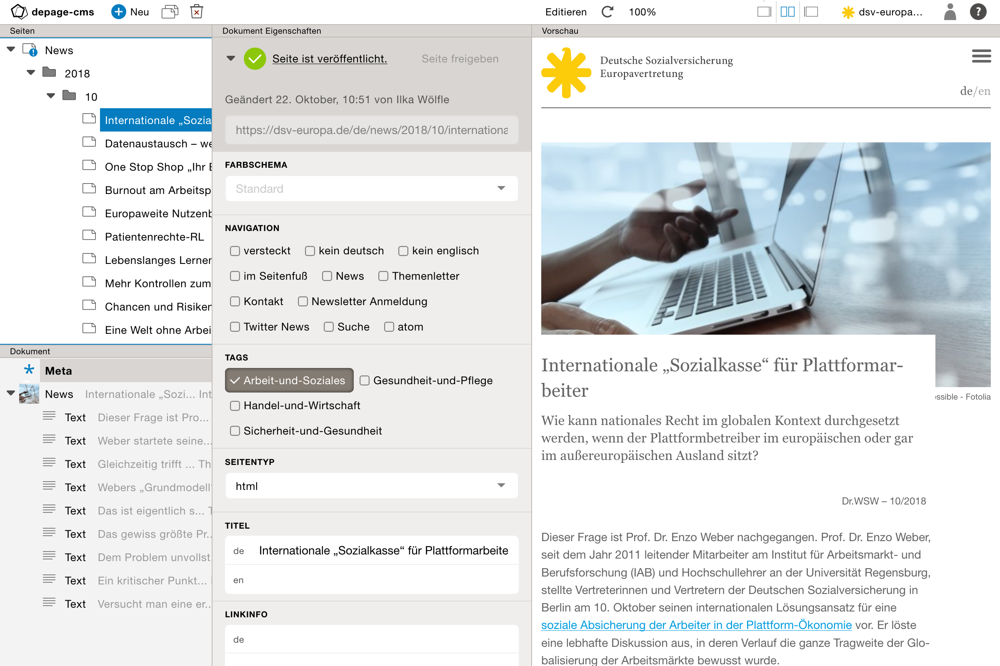

Einführung      {#get-started}
==========

[TOC]

Das Dashboard
=============

Projektübersicht
----------------

Das Dashboard ist die erste Seite, die nach dem Login angezeigt wird. Es besteht aus einer Projektübersicht mit dem Zugriff auf die einzelnen Projektfunktionen.

In der Projektübersicht stehen folgende Funktionen zur Verfügung:

- Man kann sich direkt die zuletzt geändert Seiten anzeigen lassen. Dazu klickt man einfach auf den Projektnamen oder auf den Pfeil davor. Dort wird dann das letzte Veröffentlichungsdatum angezeigt und alle Seite, die seit der letzten Veröffentlichung geändert oder freigeben wurden.
- *Editieren* öffnet die [Editieransicht](@ref editing-pages) von depage-cms.
- Über [Vorschau](@ref page-preview) lässt sich der aktuelle unveröffentlichte Stand der Seite anzeigen.
- Über [Publizieren](@ref publishing) kann der aktuelle Stand der Veränderung live genommen werden.
- Für Projekte die dies unterstützen steht der [Projektschnellzugriff](@ref project-shortcuts) zu Verfügung.
- Über den Button *Dateibibliothek* kann schnell zu der [Dateibibliothek](@ref file-library) gesprungen werden, in der die Assets wie Bilder, Videos und andere Dateien des Projektes verwaltet und hochgeladen werden.
- Über *Farben bearbeiten* können die [Farben und Farbschemata](@ref colors) des Projektes bearbeitet werden.
- Als letzter Punkt steht ein Link zu den [Einstellungen](@ref admin-project-settings) zur Verfügung.

Das Split-Interface
===================

Geteiltes Layout
----------------

Innerhalb von depage-cms arbeitet man die meiste Zeit innerhalb eines geteilten Fensters: Der linke Teil enthält die eigentliche Bedienoberfläche. Dort werden neue Seiten erstellt, Texte abgeändert oder Bilder ausgewählt. In der rechten Seite, die sich öffnet, sobald man eine Seite editiert, wird die automatische Vorschau der Seite angezeigt, die aktuell bearbeitet wird.

Sobald die Seite im Split-Modus angezeigt wird, kann das Layout umgestellt werden zwischen:

- Nur Editier-Layout
- Geteiltes Layout
- Nur Vorschau Layout

Der Editierbereich
------------------

Der Editierbereich ist immer in zwei Bereiche unterteilt. Links gibt es einen oder mehrere Strukturbäume, die immer mit ähnlichen Werkzeugen – wie verschieben, kopieren, umbenennen oder löschen – bearbeitet werden können. Rechts sind die jeweiligen Dokument Eigenschaften für das links markierte Element.

> [Siehe Seiten Editieren](@ref editing-pages)

Der Vorschaubereich
-------------------

Die Vorschau der Seiten aktualisiert sich mit jeder Änderung der Seite automatisch.

> [Siehe Vorschau](@ref page-preview)

Menüs
=====

Das Projekt Menü
----------------

Das Projektmenü bietet einen Schnellzugriff auf die folgenden Projektfunktionen, die auch über das Dashboard erreicht werden können:

- Editieren
- Dateibibliothek
- Farben
- Publizieren
- Einstellungen

Zudem kann man über das Projektmenü schnell zwischen verschiedenen Projekten zu wechseln.

Das Benutzer Menü
-----------------

Über das Benutzermenü besteht die Möglichkeit sich auszuloggen, aber auch bestimmte Benutzereinstellungen vorzunehmen (z.B. Passwort ändern).

Hilfe
-----

Über den Button Hilfe, steht eine kurze Beschreibung der Interface-Element zur Verfügung.

> [Weiter zum Thema: Seiten Editieren](@ref editing-pages)
