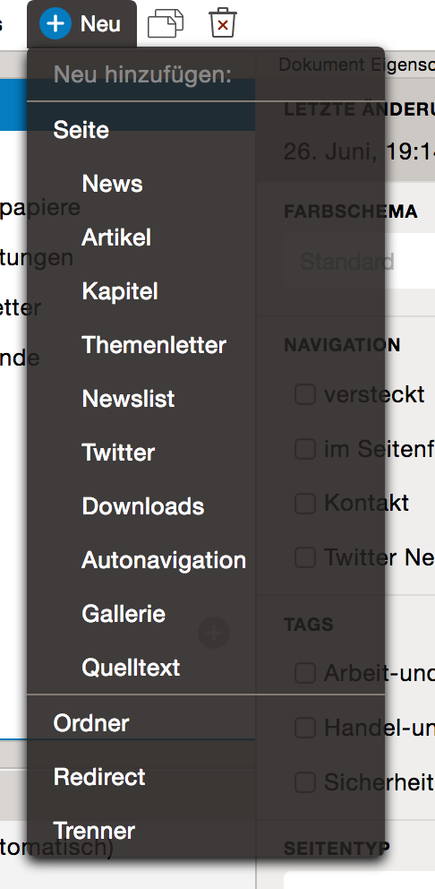
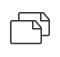

Seiten editieren    {#editing-pages}
================

[TOC]

Seiten editieren
================

Die Strukturansicht
-------------------

Die Strukturansicht im oberen linken Fensterbereich ist eine Baumdarstellung der einzelnen Seiten eines Internetauftritts. Aus dieser Seitenhierarchie und ihren Namen wird automatisch die Navigation des Internetauftritts generiert.

Zu jedem Baum stehen stehen oben verschiedene Funktionen zur Verfügung, die mit den Seiten vorgenommen werden können, wenn der Baum aktiv ist.

- Hinzufügen
- Duplizieren
- Löschen

Diese können entweder über die Toolbar des ausgewählten Baums erreicht werden oder über das Kontextmenü (rechte Maustaste) der jeweiligen Seite.

Seiten und Ordner     {#pages-and-folders}
-----------------

Es gibt drei Arten von Seiten-Elementen:

- Seiten,
- Ordner und
- Redirects.

Sie sind durch ihre unterschiedlichen Icons voneinander unterscheidbar.

Seiten und Ordner unterscheiden sich dadurch, dass Seiten immer einen Seiteninhalt enthalten. Ordner hingegen bilden nur ein Element in der Navigation, enthalten aber keinen Inhalt. Wird in der Navigation ein Ordner angewählt, wird immer das erste Seitenelement innerhalb des Ordners angezeigt, nicht der Ordner selbst. Seiten, wie auch Ordner können weitere Unterseiten enthalten. Sobald ein Element weitere Unterelemente enthält ist es mit einem Pfeil davor gekennzeichnet.

Neue Seiten hinzufügen    {#adding-pages}
----------------------

Über den Button *Neu* werden neue Seiten und Ordner in den Strukturbaum eingefügt. Zur Auswahl stehen zum einen der Ordner und die leere Seite, die noch keine Inhaltselemente enthält, und zum anderen eine Reihe vorgegebener Seiten, die schon verschiedene Inhaltselemente wie Text und Bilder enthalten können.

Eines neues Element wird immer an letzter Stelle innerhalb des gerade markierten Elementes eingefügt, und dann sofort markiert.

Mit *Enter* kann man den Editiervorgang abschließen. *Escape* bricht den Vorgang ab.

Direktmenü zum Erstellen    {#inplace-add-menu}
------------------------

Man kann auch gezielt an genau einer Stelle eine neue Seite erstellen. Wenn man mit der Maus über den rechten Bereich des Baumes fährt, werden je nach Position blaue *Plus-Buttons* angezeigt. Darüber lassen sich schnell neue Seiten direkt an der gewünschten Stelle einfügen:

Duplizieren     {#duplicating-pages}
-----------

Jede Seite lässt sich über den Button duplizieren vervielfachen. Es wird eine exakte Kopie der Seite erstellt und direkt unterhalb des Originals abgelegt.

Löschen      {#deleting-pages}
-------

Um eine Seite zu löschen muss man sie zunächst markieren und dann auf den Button *Löschen* klicken. Es erscheint dann eine Sicherheitsabfrage, ob man das Element wirklich löschen möchte, die man mit Ok bestätigen oder mit Escape abbrechen kann. Ein Element wird immer komplett mit allen Unterelementen gelöscht.

Verschieben und Kopieren    {#moving-and-copying-pages}
------------------------

Seiten- und Ordnerelemente lassen sich einfach mit der Maus nehmen und an eine neue Position verschieben. Wenn man sie auf einem anderen Element fallen lässt, wird die Seite in das andere Element verschoben und erscheint dort an letzter Stelle. Wird es zwischen zwei Elementen fallengelassen, wird es an diese Stelle verschoben. Eine blaue Markierung zeigt an, wohin das Element gelegt wird.

Seiten werden auf die gleiche Art und Weise kopiert, wie sie auch verschoben werden. Zum kopieren muss nur zusätzlich die *Strg-Taste* gehalten werden, bis das Element an der neuen Stelle losgelassen wird.

Dokumente Editieren    {#editing-documents}
===================

Die Dokumentenstruktur
----------------------

Neben der Navigationsstruktur gibt es noch eine Dokumentenstruktur. Hier wird der eigentliche Inhalt einer Seite bearbeitet. Zur Bearbeitung stehen die selben Mittel zur Verfügung, wie auch bei der Bearbeitung der Navigationsstruktur: [Hinzufügen](@ref adding-pages), [Duplizieren](@ref duplicating-pages), [Verschieben, Kopieren](@ref moving-and-copying-pages) und [Löschen](@ref deleting-pages).

Seitenelemente hinzufügen
-------------------------

Neue Elemente werden über den Button *Neu* in das Dokument eingefügt. Es werden jeweils nur solche Elemente angezeigt, die auch in das aktuelle Elemente eingefügt werden können – beispielsweise ein neuer Link in eine Linkliste, ein neues Bild in eine Slideshow oder einen neuen Text in einen Abschnitt.

Genau wie in der Navigationsstruktur steht auch hier das [Direktmenü](@ref inplace-add-menu) zur Verfügung.

Sobald ein Seitenelement markiert wird, wird der Inhalt im Eigenschaftsbereich angezeigt und kann dort bearbeitet werden.

Eigenschaftstypen
-----------------

Es stehen folgende Eigenschaftselemente zur Verfügung:

- **Text (einzeilig)**

    Das *Text (einzeilig)* steht für unformatierten, einzeiligen Text, wie beispielsweise einzeilige Überschriften zur Verfügung.

- **Text (mehrzeilig)**

    Das *Text (mehrzeilig)* steht für unformatierten, mehrzeiligen Text zur Verfügung, wie beispielsweise mehrzeilige Überschriften oder kurze Teaser.

- **Text (formatiert)**

    Das *Text (formatiert)* steht für formatierten, mehrzeiligen Text zur Verfügung. Dort können Texte mit Auszeichnungen wie fett oder kursiv versehen werden. Es werden auch Absatzstile wie Listen mit Aufzählungszeichen oder nummerierte Listen unterstützt. Außerdem können innerhalb des Textes Links zu anderen Seiten gesetzt werden.

    Dazu markiert man zunächst den Textabschnitt, der als Link dienen soll und klickt dann auf das Link-Symbol. Es wird in einer Dialogbox das Linkziel abgefragt, das entweder auf eine andere Seite innerhalb des eigenen Internetauftritts, auf Dateien in der Dateibibliothek oder auf andere Internetseiten verweisen kann.

- **Bild**

    Mit Hilfe des Bild-Elements kann ein Bild aus der Dateibibliothek ausgewählt werden und so in die Seite integriert werden. In das Alt-Textfeld kann ein Text eingegeben werden, der dann sichtbar ist, wenn jemand keine Bilder anzeigen kann, oder auch solange ein Bild noch nicht vollständig geladen ist.

    Falls die Höhe oder Breite für ein Bild erzwungen wird, stehen in der Dateibibliothek nur solche Bilder zur Verfügung, die die richtigen Bildmaße haben.

    Je nach Template kann auch noch ein Link ausgewählt werden, der geöffnet wird, wenn man auf das Bild klickt.

- **Datum**

    Über *Datum* können Datumsangaben bearbeitet werden.

- **Uhrzeit**

    Über *Ührzeit* wird eine Uhrzeit angegeben.

- **Link**

    *Link* ermöglicht es Verweise in die Seite einzufügen, die nicht innerhalb des Textes auftauchen, wie beispielsweise in Linklisten. Es kann auf eine andere Seite innerhalb des eigenen Internetauftritts, auf Dateien in der Dateibibliothek oder auf andere Internetseiten verwiesen werden.

- **Quelltext**

    Der Quelltext steht nur Administratoren und Developern zur Verfügung. Mit dessen Hilfe können einzelne HTML- oder Script-Elemente direkt in eine Seite integriert werden, ohne dass man dafür die Templates abändern müsste. Dies ist vor allem für Einzelfälle oder Scripts gedacht, die nicht über normale Templates abgedeckt sind. Der Gebrauch sollte aber vermieden werden.

Das Meta Element    {#meta-property}
================

Alle Seiten und Ordner in depage-cms haben ein gemeinsames Element: Das *Meta Element*. Es wird automatisch markiert, wenn eine Seite ausgewählt wird.

Im Meta Element werden Einstellungen vorgenommen, die für jede Seite zur Verfügung stehen:

- Als erstes ist zu sehen, wer die Seite als letztes und zu welchem Zeitpunkt bearbeitet hat. Hier kann auch der aktuelle Stand der Seite freigegeben werden, so dass der Inhalt bei der nächsten Veröffentlichung mit übernommen wird.

- Als nächstes kommt die Auswahl des Farbschemas. depage-cms arbeitet mit [Farbschemata](@ref colors), Sätzen von verschiedenen Farben, die als Gruppe ausgewählt werden und auf die jeweilige Seite angewendet werden.

- Der Punkt Navigation entscheidet darüber, ob und an welcher Stelle eine Seite in der Navigation erscheint.

- Mit Tags läßt sich eine Seite in Kategorien einordnen und so zu einem späteren Zeitpunkt besser filtern.

- Bei Titel kann der Titel der Seite angegeben werden, die in der Kopfzeile des Browser-Fensters erscheinen soll.

- Unter Linkinfo kann ein zusätzlicher Beschreibender Text angegeben werden, der dazu benutzt werden kann den lokalisierten Seitentitel in der Navigation festzulegen. Das ist besonders wichtig bei mehrsprachigen Seiten.

- Unter Beschreibung kann ein Beschreibungstext der Seite oder Stichworte angegeben werden, die dann – in der Regel für den Benutzer unsichtbar – in den Description-Tag der HTML-Seite eingetragen werden. Dieser Text wird unter anderem von Suchmaschinen ausgelesen und teilweise auch in den Suchergebnissen mit angezeigt.

Seitenvorschau     {#page-preview}
==============

Die Vorschau
------------

Die Vorschau der Seiten aktualisiert sich mit jeder Änderung der Seite automatisch. Ebenfalls automatisch ändert sich die Sprache der Vorschau: Sobald beispielsweise ein deutsches Textfeld bearbeitet wird, wird die deutsche Version der Seite angezeigt, wenn ein englisches Textfeld bearbeitet wird, wird die englische Version angezeigt.

Aktualisieren
-------------

Wenn sich die Vorschau nicht wie gewünscht aktualisieren sollte, dann kann die Vorschau (und deren Dateien wie Bilder und Stylesheets) über den Aktualisieren-Button neu laden.

Zoom
----

Um die Seite auch auf kleineren Geräten in der breiteren Desktop-Variante anzeigen lassen zu können, steht ein Zoom-Button zur Verfügung, mit der die Vorschau der Seite in einer andere Größe (50%, 75% oder 100%) angezeigt werden kann.

Projektschnellzugriff      {#project-shortcuts}
=====================

Über den *Projektschnellzugriff* können direkt über das Dashboard schnell viel verwendete Seitentypen neu angelegt werden – wie beispielsweise News oder Blog-Einträge. Diese werden dann automatisch an der richtigen Stelle in der Seitenstruktur angelegt, können aber danach natürlich bei Bedarf wie gewohnt verschoben werden.

> [Weiter zum Thema: Publizieren](@ref publishing)
