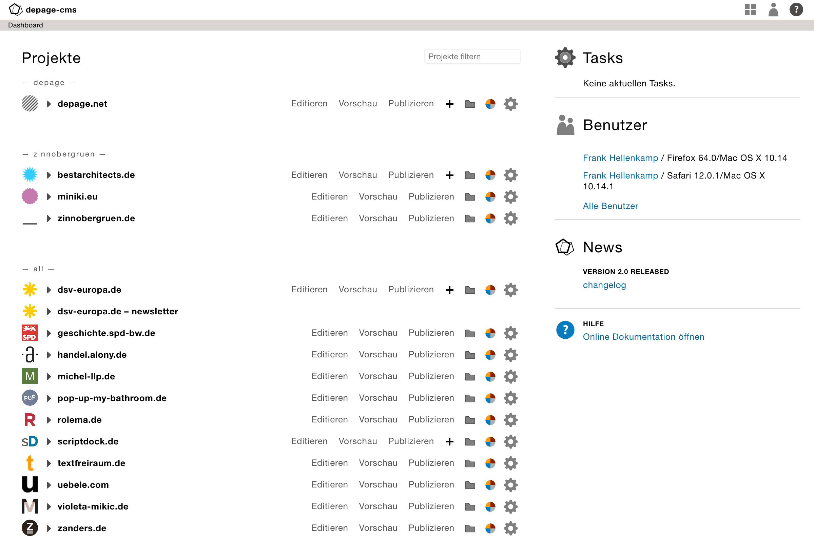

Einführung
==========

[TOC]

Das Interface
=============

Das Dashboard
-------------

Beim Start von depage-cms begrüßt einen zunächst das Login-Fenster. Es muss der Benutzername und das dazugehörige Passwort eingegeben werden. Nach Eingabe der Zugangsdaten öffnet sich das Dashboard von depage-cms. Man ist nun am System angemeldet.
Im Startscreen kann man sich direkt die zuletzt geändert Seiten anzeigen lassen. Über Editieren wird die Editieransicht von depage-cms geöffnet. Über Vorschau lässt sich der aktuelle unveröffentlichte Stand der Seite anzeigen.

Das Split-Interface
-------------------

Innerhalb von depage-cms arbeitet man die meiste Zeit innerhalb eines geteilten Fensters. Der linke Teil enthält die eigentliche Bedienoberfläche von depage-cms. Dort werden neue Seiten erstellt, Texte abgeändert oder Bilder ausgewählt. In der rechten Seite, die sich öffnet, sobald man eine Seite editiert, wird die automatische Vorschau der Seite angezeigt, die aktuell bearbeitet wird.

kjsdhf kjsdhf

Der Editierbereich
------------------

Der Editierbereich ist immer in zwei Bereiche unterteilt. Links gibt es einen oder mehrere Strukturbäume, die immer mit ähnlichen Werkzeugen – wie verschieben, kopieren, umbenennen oder löschen – bearbeitet werden können. Rechts sind die jeweiligen Einstellungsfelder für das links markierte Element.

In der Titelzeile eines Strukturbaums ist ein Ladehinweis zu sehen, wenn gerade Daten zum
Server gesendet oder vom Server empfangen werden, weil man selbst oder jemand anderes eine Seite bearbeitet hat. Um Platz zu sparen, können die Strukturbäume auch eingeklappt werden.

Der Einstellungsbereich erweitert sich je nach Inhalt dynamisch nach unten, und muss bei Bedarf entsprechend nach oben oder nach unten gescrollt werden.

Seitenvorschau
==============

Der Vorschau-Button
-------------------

Links unten befindet sich der Vorschau Button. Wenn man darauf klickt, wird das Vorschau-Fenster aktualisiert.
Wenn man die Maus etwas länger auf dem Button gedrückt hält, springt ein Menü auf, in dem man verschiedene Einstellungen für die Vorschau vornehmen kann.
Beispielsweise lässt sich dort ein anderes Template wählen – z.B.: debug anstatt html – das den Seiteninhalt dann anders darstellt.
Alternativ kann die aktuell angezeigte Seite über den Button Aktualisieren über der Vorschau neu geladen werden.

