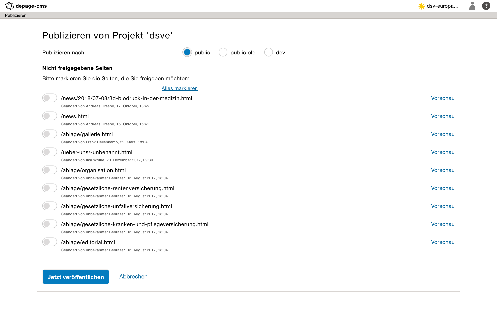
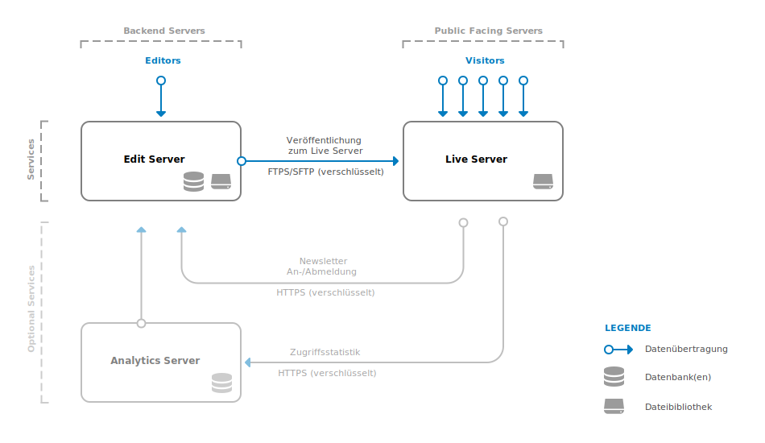

Publizieren     {#publishing}
===========

[TOC]

Eine der wichtigsten Funktionen in depage-cms ist das Veröffentlichen. Mit dieser Funktion wird der aktuelle Stand der Seiten und der Datei-Bibliothek auf einen Webserver kopiert, so dass sie dann für den normalen Besucher der Internetseite sichtbar werden.

Die Seiten können dann entweder lokal auf dem gleichen Server veröffentlicht werden, oder per ftp auf einem Remote-Server. Die veröffentlichte Live-Seite ist somit unabhängig vom Editier-Server auf dem depage-cms läuft.

Freigabe von Seiten
===================

Die Freigabe einer Seite speichert den aktuellen Stand der Seite in der Dokument-Historie ab. Dieser ist dann zwar nicht direkt öffentlich sichtbar, wird aber bei der nächsten Veröffentlichung zur Generierung der entsprechenden Seite verwendet.

Seitenstatus
------------

Im [Meta Element](@ref meta-property) wird der aktuelle Status der Seite angezeigt. Eine Seite kann entweder

- noch nicht veröffentlicht sein,
    

- mit dem aktuellen Stand veröffentlicht sein oder
    

- veröffentlicht sein, aber noch unveröffentlichte Änderungen enthalten.
    

Freigabe anfragen
-----------------

Editoren können selbst keine Seiten freigeben. Dies können nur Benutzer, die zum Veröffentlichen der Seite berechtigt sind. Editoren können aber die Freigabe einer Seite erfragen. Die Funktion hierzu steht im [Meta Element](@ref meta-property) zu Verfügung.

Beim Drücken des Buttons, werden alle Benutzer, die zum Veröffentlichen eines Projektes berechtigt sind, per Email über die Anfrage informiert.

Dieser Button steht so lange zur Verfügung, bis die entsprechende Seite freigeben wurde, damit Editoren die Freigabe notfalls auch erneut anfragen können.

Seiten Freigeben
----------------

Benutzer, die das Recht zur Veröffentlichung besitzen können Seiten selbst freigeben und brauchen die Freigabe nicht zu beantragen.

Dies kann entweder im Meta Element direkt vorgenommen werden oder direkt bei der Veröffentlichung der Seite.

Publizieren
===========

Das Publizieren kopiert den aktuell freigegebenen Stand der Seite auf den Live-Server und synchronisiert dabei die Dateibibliothek. Das Publizieren kann zudem den Such-Index für die Live-Seite aktualisieren, und die Datenbankschemata der Live-Seite aktualisieren, wenn dieser von der Live-Seite unterstützt wird.

Zur Veröffentlichung berechtigte Benutzer können diese direkt über das Dashboard unter *Publizieren* auslösen oder über der Projektmenü.

Im Publikationsdialog werden alle geänderten und noch nicht veröffentlichten Seiten angezeigt, können dort in der Vorschau angezeigt werden und einzeln zur Freigabe ausgewählt werden.

Über den Button *Jetzt veröffentlichen* wird der Task zum Publizieren der Seite gestartet, der die Seite dann im Hintergrund publiziert. Da der Publizierungstask unabhängig vom Benutzer abläuft, können sich die Benutzer auch ein- und ausloggen, ohne dass dieser Prozess abgebrochen wird. Die Seite kann auch weiterhin bearbeitet werden, ohne dass die Veröffentlichung davon betroffen wäre.

Serverstruktur
--------------

Die folgende Darstellung zeigt schematisch das Verhältnis von Live- zum Edit-Server.

> [Weiter zum Thema: Dateibibliothek](@ref file-library)
