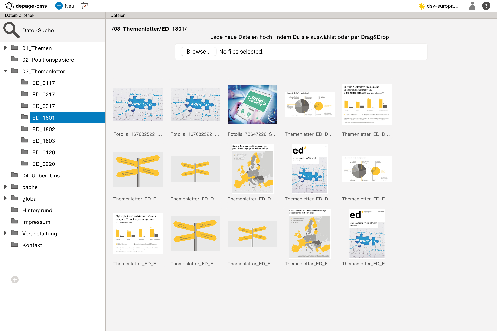
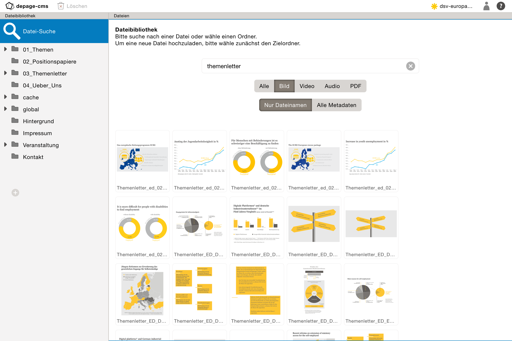

Die Dateibibliothek     {#file-library}
===================

[TOC]

Dateibibliothek
===============

Die Dateibibliothek ist ein Satz von Dateien, die nicht von depage-cms direkt erstellt werden, sondern in Seiten eingebunden oder von dort verlinkt werden können.

Über den Button *Neu* kann man einen Ordner in der Dateihierarchie hinzufügen. Die Reihenfolge der Ordner kann verändert werden.

Ordner umbenennen / verschieben
-------------------------------

Ordner können ineinander mitsamt ihrem Inhalt verschoben oder auch umbenannt werden.

> **Vorsicht**
>
> Es ist allerdings dabei zu beachten, dass sich zu allen Dateien, die sich in diesem Ordner befinden und schon verlinkt sind, die Verknüpfungen lösen, und *so nicht mehr auf der Seite angezeigt werden*.

Es wird deshalb empfohlen, sich möglichst vorab eine flexible und erweiterbare Struktur der Ordner zu überlegen, so dass die Dateibibliothek problemlos mit den Anforderungen der Seite mitwachsen kann.

Ordner löschen
-------------

Ordner können über den Button löschen auch wieder gelöscht werden.

> **Vorsicht**
>
> Es gilt auch beim Löschen: *Alle zu in diesem Ordner befindlichen Dateien gesetzten Verknüpfungen gehen verloren*.

Datei-Upload
------------

Es können auch neue Dateien in die Dateibibliothek hochgeladen werden.

Dazu klickt man auf den Button Upload. Es öffnet sich ein Dialog, in dem man verschiedene Dateien auswählen kann und diese in das aktuell gewählte Verzeichnis hochladen kann. Bis der Upload abgeschlossen ist, sollte die Dateibibliothek geöffnet bleiben.

Dateien lassen sich auch per *Drag and Drop* hochladen in dem sie direkt in die Dateiübersicht (die rechte Seite des Fensters) gezogen werden. Der Upload startet dann sofort in den gerade gewählten Ordner.

> **Vorsicht**
>
> _Dateien, die bereits unter dem gleichen Namen im aktuellen Verzeichnis liegen, werden ohne Vorwarnung überschrieben!_
> _Das dient vor allem dazu, dass Bilder einfach mit einer neuen Version aktualisiert werden können, ohne für jede Datei eine Überschreib-Warnung bestätigen zu müssen._

Dateien löschen
---------------

Da beim Veröffentlichen immer die gesamte Dateibibliothek auf dem Server aktualisiert wird empfiehlt es sich von Zeit zu Zeit unbenötigte
Dateien zu löschen. Dazu markiert man einfach die Dateien in der Dateiübersicht und drückt den Button löschen. Nach einer Sicherheitsabfrage wird die Datei aus der Dateibibliothek entfernt.

Dateien Suchen        {#file-search}
==============

Um Dateien und Bilder zu finden, die bereits in die Dateibibliothek hochgeladen wurden, kann die *Datei-Suche* benutzt werden.

Man kann entweder nach dem Dateinamen suchen oder alle Metadaten in die Suche mit einbeziehen. Zu den Metadaten gehören: Dateiname, Ordername, Bild-, Audio- oder Video-Metadaten (wie beispielsweise Beschreibung, Titel oder Copyright).

Es ist auch möglich die Dateisuche nach Dateitypen einzuschränken.
- Bild
- Video
- Audio
- PDF

> [Weiter zum Thema: Farben](@ref colors)
