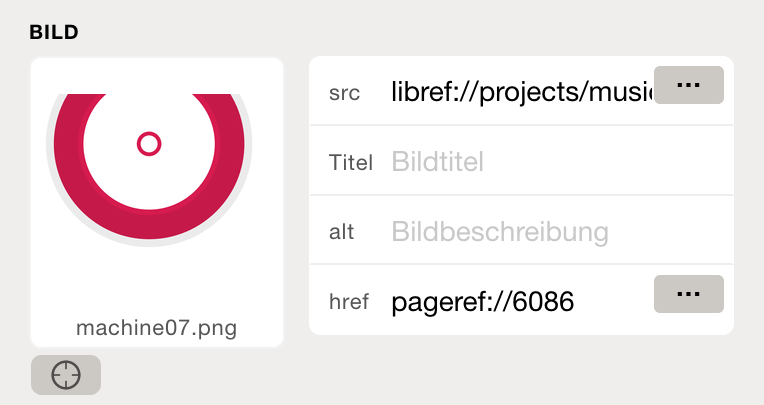
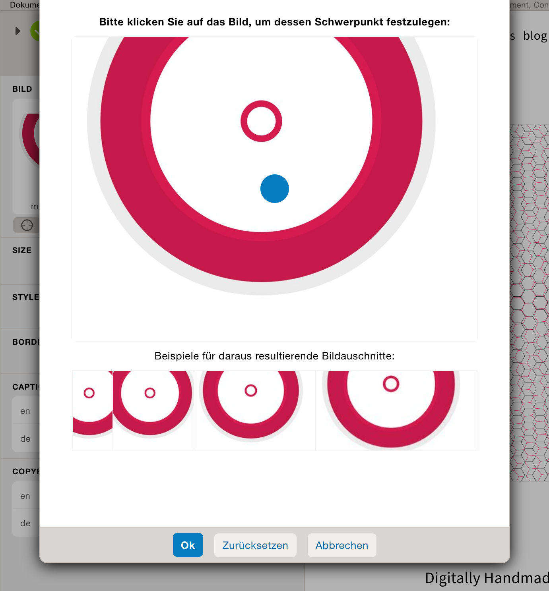

Bildschwerpunkt       {#image-gravitational-center}
===============

To find files and images that have been uploaded to the file library, you can use the *File Search*.

Den Bildschwerpunkt über die Dokument Eigenschaften festlegen
-------------------------------------------------------------

Den Bildschwerpunkt über die Dateibibliothek festlegen
------------------------------------------------------

> [Weiter zum Thema: Farben](@ref colors)
