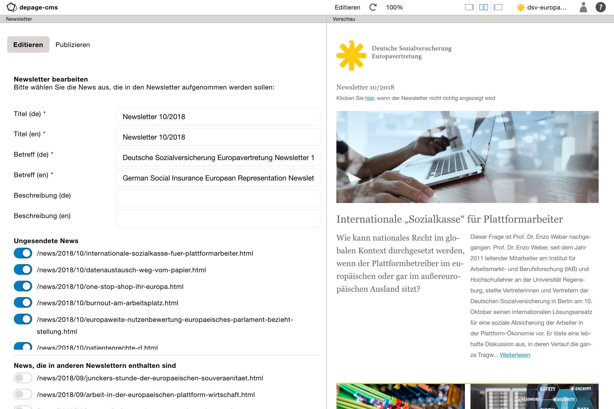
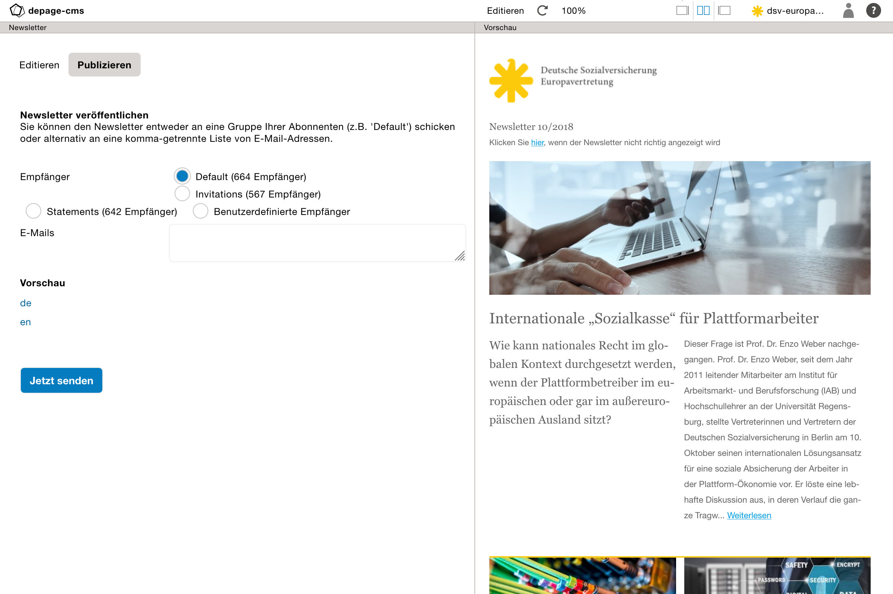

Newsletter    {#newsletter}
==========

[TOC]

Newsletter
==========

Editieren
---------

Projekte, die einen automatischen Newsletter unterstützen, zeigen diesen direkt in der Projektübersicht unter dem Hauptprojekt an. Wenn man dieses über den Pfeil aufklappt, wird eine Liste der vorhandenen Newsletter angezeigt, aus der diese dann editiert, veröffentlicht oder auch wieder gelöscht werden können.

Mit Klick auf den Newsletter selbst oder den Button Editieren, öffnet sich die Bearbeitungsansicht des Newsletters.

Dort muss dann der Titel des Newsletters und der Betreff für die herausgehenden E-Mails angegeben werden.

Darunter befindet sich zwei Listen der zur Verfügung stehenden News-Meldungen. Die obere Liste enthält alle Meldungen, die noch in keinem anderen Newsletter verwendeten wurden. Die untere Liste alle schon in anderen Newslettern ausgewählte Meldungen. Durch aktivieren können Sie dem aktuellen Newsletter hinzugefügt werden. Die Vorschau auf der rechten Seite zeigt dann jeweils automatisch die Vorschau, wie der Newsletter aussehen wird.

Es kann zusätzlich eine Beschreibung des Newsletters angegeben werden. Diese ist aber nicht innerhalb des Newsletters sichtbar, sondern wird als Meta-Description-Tag in die HTML-Version des Newsletters mit aufgenommen.

Veröffentlichen
---------------

Über Veröffentlichen kann der Newsletter dann entweder an eine Empfänger Liste gesendet werden:

- Die Liste *Default* entspricht der Standardliste und enthält alle Empfänger, die sich über die Webseite angemeldet haben.

- Die Liste *Test* ist eine interne Gruppe, der der Newsletter vorab zum Test geschickt werden kann.

- Bei Auswahl von *Benutzerdefinierte Empfänger* kann der Newsletter auch an manuell angegebene E-Mail-Adressen geschickt werden. Die E-Mail-Adressen werden dafür unter E-Mails als kommagetrennte Liste angegeben.

Über *Vorschau* kann man sich die Vorschau des Newsletters in der jeweiligen Sprache anzeigen lassen. Vor Versand ist es wichtig, dabei beide Sprachversionen zu checken.

Versenden
---------

Über *Jetzt senden* wird der Newsletter dann zunächst als HTML-Version auf der Webseite veröffentlicht und danach an alle ausgewählten bzw. angegeben Empfänger verschickt.
