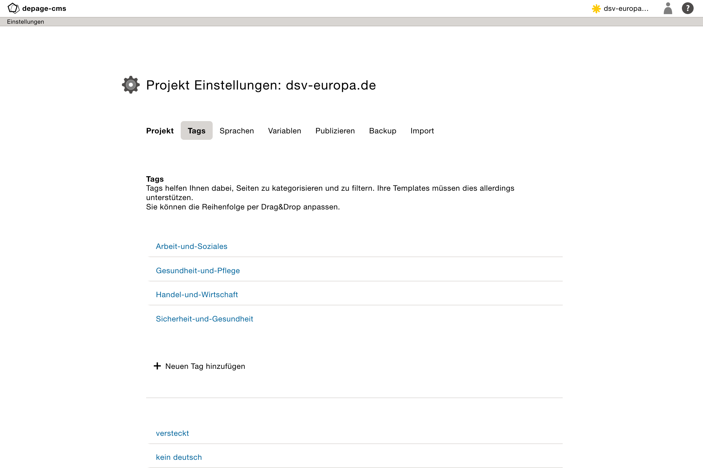
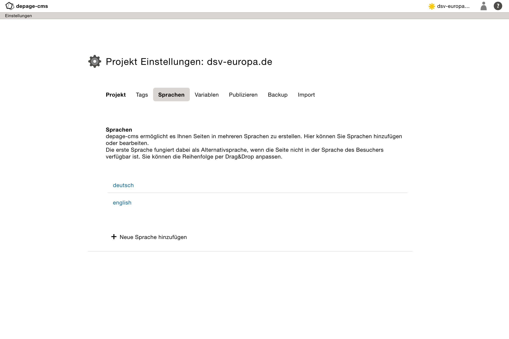

Projekteinstellungen     {#admin-project-settings}
====================

[TOC]

Projekteinstellungen
====================

Auf den Einstellungsseiten können verschiedene Parameter des Projektes angepasst werden.

*In der Regel werden diese von den Administratoren verwaltet.*

Tags
----

*Tags* helfen Ihnen dabei, Seiten zu kategorisieren und zu filtern. Ihre Templates müssen dies allerdings unterstützen. Die Reihenfolge der Tags kann per Drag and Drop angepasst werden.

Navigation
----------

Navigationseigenschaften helfen dabei eine Seite zu automatisch strukturieren, oder bestimmte Einstellungen in den Templates vorzunehmen.

Übliche Navigationseigenschaften sind beispielsweise:

- versteckt: Seite wird zwar generiert, aber nicht in der Navigation angezeigt
- kein deutsch: Deutsche Version der Seite wird nicht angezeigt
- kein englisch: Englische Version der Seite wird nicht angezeigt
- News: Seite oder Ordner enthält Seiten aus denen der Atom-Feed erzeugt wird

*In der Regel werden diese von den Administratoren verwaltet, da die Funktion sehr von den Templates des jeweiligen Projektes abhängt.*

Sprachen
--------

depage-cms ermöglicht es Ihnen Seiten in mehreren Sprachen zu erstellen. Die Sprachversion des Projektes werden immer parallel erstellt, dass heißt, dass depage-cms immer alle Seiten in jeder angelegten Sprache und in der gleichen Seitenstruktur generiert.

Die erste Sprache fungiert dabei als Alternativsprache, wenn die Seite nicht in der Sprache des Besuchers verfügbar ist. Die Reihenfolge der Sprachen kann per Drag and Drop angepasst werden.

Die erste angelegte Sprache wird als Standardsprache für die Besucher ausgewählt, wenn der Browser keine der vorhandenen Sprachen unterstützt.

